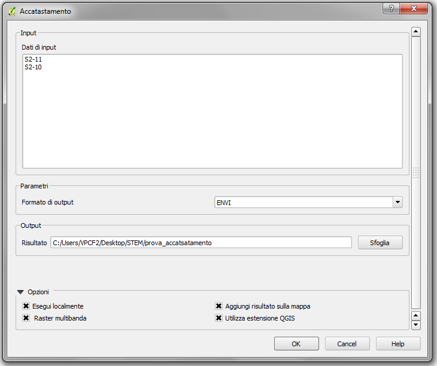

Accatastamento
================================

Il modulo esegue l'accatastamento di più immagini.

Input
------------

**Dati di input**: nella finestra compaiono i raster attualmente aperti in QGIS.
                   Selezionare i raster da accatastare.

Parametri
------------

* **Formato di output**:
	* *ENVI*: formato compatibile con il software ENVI.
	* *GTIFF*: formato GeoTiff.

Output
------------

* **Risultato**: inserire percorso e nome del file di output.

