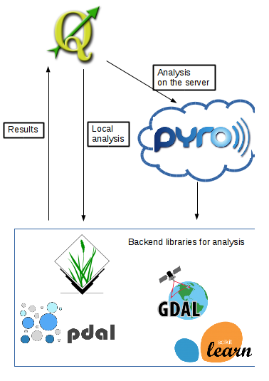

Introduzione
----------------
Il **progetto STEM** (Sistema informativo per il Telerilevamento E il Monitoraggio delle risorse del territorio e dell'ambiente trentino)
risponde alla necessità di dotare la Provincia Autonoma di Trento (PAT) di uno strumento integrato per l'elaborazione, archiviazione
e diffusione, in maniera accurata e aggiornata, di informazioni acquisite mediante sistemi di telerilevamento
(dati multispettrali, iperspettrali, LIDAR, RADAR, ecc.), al fine di supportare i processi di pianificazione, gestione e
controllo territoriale. il sistema prevede:

 * strumenti per l'aggiornamento periodico distribuzione della classificazione delle aree agro-silvo-pastorali e delle principali
   specie forestali, nonché per la stima dei parametri forestali, attraverso tre tipologie di elaborazione di dati telerilevati (con
   riferimento alle metodologie e procedure sviluppate nelle sperimentazioni FORLIDAR e AGRICOLTURA)

 * archiviazione e gestione dei dati telerilevati attraverso un'infrastruttura dati territoriale per il telerilevamento coordinata con
   l'attuale sistema SIAT

Struttura del plugin
-----------------------

Di seguito è possibile vedere com'è strutturato il plugin STEM per QGIS

